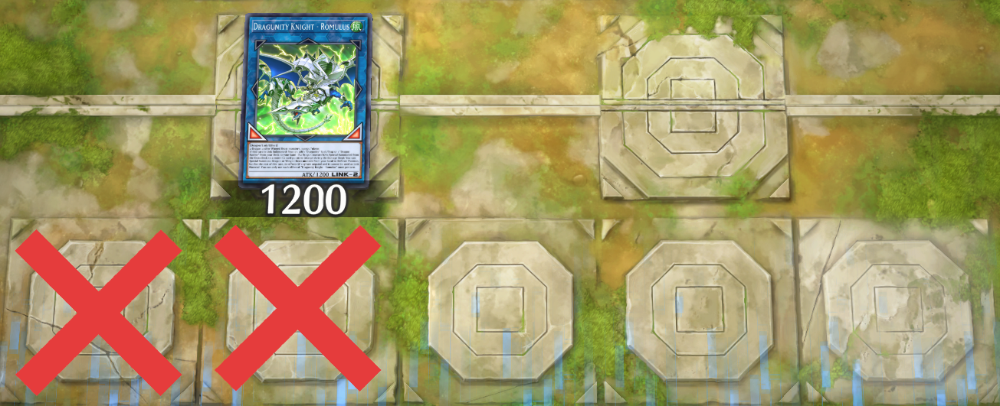

- [Locks](#locks)
- [Gameplan](#gameplan)
- [Example Combos](#example-combos)
- [Rokket](#rokket)
	- [Borrelend Dragon](#borrelend-dragon)
- [Bystial](#bystial)
- [Red-Eyes](#red-eyes)
- [Baby Dragon](#baby-dragon)
- Generic Dragon Extender
## Locks

- Rokket Tracer locks you to only using Dark-Attribute after using its ①st effect
- Guardragon Pisty locks you to only using Dragon-Type while it's on the field

## Gameplan

- Striker Dragon → Romulus

## Example Combos
- Black Metal Dragon + 1 Discard

<iframe allow="fullscreen" allowfullscreen height="100%" src="https://streamable.com/e/a3bp3r?loop=0" width="100%" style="border:none; width:100%; height:100%; position:absolute; left:0px; top:0px; overflow:hidden;"></iframe>

- Starliege Seyfert (or Chaos Space) + 1 Dragon Extender + 1 Discard

<iframe allow="fullscreen" allowfullscreen height="100%" src="https://streamable.com/e/cdwmlr?loop=0" width="100%" style="border:none; width:100%; height:100%; position:absolute; left:0px; top:0px; overflow:hidden;"></iframe>

## Rokket

| Card                    | Effect                                                                                                                                                                                                                                                                                                                                                                                                                                                                                                                                            | Comment                                                                                                                                                                             |
| ----------------------- | ------------------------------------------------------------------------------------------------------------------------------------------------------------------------------------------------------------------------------------------------------------------------------------------------------------------------------------------------------------------------------------------------------------------------------------------------------------------------------------------------------------------------------------------------- | ----------------------------------------------------------------------------------------------------------------------------------------------------------------------------------- |
| Rokket Tracer           | ①: (Quick Effect): You can target 1 face-up card you control; destroy it, and if you do, Special Summon 1 "Rokket" monster from your Deck, except "Rokket Tracer", also you cannot Special Summon monsters from the Extra Deck for the rest of this turn, except DARK monsters. You can only use this effect of "Rokket Tracer" once per turn.                                                                                                                                                                                                    | Access to this card from Absorouter Dragon/Quick Launch/Starliege Seyfert (only do this if you already have the baby dragon)                                                        |
| Rokket Recharger        | ~~①: If a DARK monster(s) you control that was Special Summoned from the Extra Deck is destroyed by battle or card effect: You can send this card from your hand or field to the GY, then target 1 of those destroyed monsters; Special Summon 1 DARK monster from your GY with a different original name from that targeted monster. You can only use this effect of "Rokket Recharger" once per turn. ②: While you control a DARK monster Special Summoned from the Extra Deck, your opponent's monsters cannot target this card for attacks.~~ |                                                                                                                                                                                     |
| Rokket Caliber          | ①: You can Special Summon this card (from your hand) to your zone a DARK Link Monster points to. You can only Special Summon "Rokket Caliber" once per turn this way. ~~②: You can Tribute this card; Special Summon 1 DARK Dragon or Machine monster from your hand, except "Rokket Caliber". You can only use this effect of "Rokket Caliber" once per turn.~~                                                                                                                                                                                  | Dragon Extender. Summon this if you already have "Rokket Recharger"                                                                                                                 |
| Absorouter Dragon       | ~~①: If you control a "Rokket" monster, you can Special Summon this card (from your hand). You can only Special Summon "Absorouter Dragon" once per turn this way.~~ ②: If this card is sent to the GY: You can add 1 "Rokket" monster from your Deck to your hand. You can only use this effect of "Absorouter Dragon" once per turn.                                                                                                                                                                                                            | Rokket Tracer Searcher                                                                                                                                                              |
| Quick Launch            | ①: Special Summon 1 "Rokket" monster from your Deck, but it cannot attack, also destroy it during the End Phase.                                                                                                                                                                                                                                                                                                                                                                                                                                     |                                                                                                                                                                                     |
| Borreload Savage Dragon | ①: If this card is Synchro Summoned: You can equip 1 Link Monster from your GY to this card, and if you do, place Borrel Counters on this card equal to that Link Monster's Link Rating. ~~②: This card gains ATK equal to half the ATK of the monster equipped to it by its effect.~~ ③: When your opponent activates a card or effect (Quick Effect): You can remove 1 Borrel Counter from this card; negate the activation. You can only use this effect of "Borreload Savage Dragon" once per turn.                                           | "Rokket Recharger/Starliege Seyfert/Black Dragon Collapserpent/White Dragon Wyverburster" + "Rokket Tracer/Rokket Caliber". Destroy the equipped monster doesn't remove the negate. |
### Borrelend Dragon

| Card                       | Effect                                                                                                                                                                                                                                                                                                                                                                                                                                                                                                                                        | Comment                                                                                                                               |
| -------------------------- | --------------------------------------------------------------------------------------------------------------------------------------------------------------------------------------------------------------------------------------------------------------------------------------------------------------------------------------------------------------------------------------------------------------------------------------------------------------------------------------------------------------------------------------------- | ------------------------------------------------------------------------------------------------------------------------------------- |
| Dragunity Knight - Romulus | ①: If this card is Link Summoned: You can add 1 "Dragunity" Spell/Trap or 1 "Dragon Ravine" from your Deck to your hand. ~~②: If a Dragon monster(s) is Special Summoned from the Extra Deck to a zone this card points to (except during the Damage Step): You can Special Summon 1 Dragon or Winged Beast monster from your hand in Defense Position, but for the rest of this turn, its effects (if any) are negated and it cannot be used as Link Material.~~ You can only use each effect of "Dragunity Knight - Romulus" once per turn. | Don't use the ②nd effect. Don't summon to the zone under or to the left of Romulus  |
| Dragon Ravine              | ①: Once per turn: You can discard 1 card, then activate 1 of these effects; ~~● Add 1 Level 4 or lower "Dragunity" monster from your Deck to your hand.~~ ● Send 1 Dragon monster from your Deck to the GY.                                                                                                                                                                                                                                                                                                                                   | Target Priority: Absorouter Dragon >The Bystial Lubellion = Starliege Seyfert                                                         |
| Guardragon Pisty           | You cannot Special Summon monsters, except Dragon monsters. ①: During your Main Phase: You can target 1 of your Dragon monsters that is banished or in your GY; Special Summon it to your zone that 2 or more Link Monsters point to. You can only use this effect of "Guardragon Pisty" once per turn. You can only Special Summon "Guardragon Pisty(s)" once per turn.                                                                                                                                                                      | Summon this in the zone where Romulus pointed to the left.                                                                            |
| Triple Burst Dragon        | ~~①: Once per turn, during the Damage Step, when a Spell/Trap Card, or monster effect, is activated (Quick Effect): You can negate the activation. ②: If this card attacks a Defense Position monster, inflict piercing battle damage. ③: During your Main Phase, except the turn this card was Special Summoned: You can Tribute this card, then target 1 Link-2 or lower monster in your GY; Special Summon it, then you can Special Summon 1 Level 4 or lower Dragon monster from your hand.~~                                             | This is mainly used for the Link Arrow pointing down. Summon to the zone where Romulus used to be at.                                 |
## Bystial

All the Level 6 Bystial have the ①st effect:

> ①: You can target 1 LIGHT or DARK monster in either GY; banish it, and if you do, Special Summon this card from your hand. This is a Quick Effect if your opponent controls a monster.

This mean that they can be used as Dragon extender.

| Card                  | Effect                                                                                                                                                                                                                                                                                                                                                                                                                                                                                                                                                              | Comment                                                                                                                       |
| --------------------- | ------------------------------------------------------------------------------------------------------------------------------------------------------------------------------------------------------------------------------------------------------------------------------------------------------------------------------------------------------------------------------------------------------------------------------------------------------------------------------------------------------------------------------------------------------------------- | ----------------------------------------------------------------------------------------------------------------------------- |
| Bystial Magnamhut     | ①: You can target 1 LIGHT or DARK monster in either GY; banish it, and if you do, Special Summon this card from your hand. This is a Quick Effect if your opponent controls a monster. ②: If this card is Special Summoned: You can activate this effect; during the End Phase of this turn, add 1 Dragon monster from your Deck or GY to your hand, except "Bystial Magnamhut". You can only use each effect of "Bystial Magnamhut" once per turn.                                                                                                                 | The best Level 6 Bystial, always add this with "The Bystial Lubellion"'s effect.                                              |
| Bystial Saronir       | ①: You can target 1 LIGHT or DARK monster in either GY; banish it, and if you do, Special Summon this card from your hand. This is a Quick Effect if your opponent controls a monster. ②: If this card is sent to the GY: You can send 1 "Bystial" monster or 1 "Branded" Spell/Trap from your Deck to the GY, except "Bystial Saronir". You can only use each effect of "Bystial Saronir" once per turn.                                                                                                                                                           | The 2 targets for the ②nd effect are "The Bystial Lubellion" or "Branded Regained"                                            |
| Bystial Druiswurm     | ①: You can target 1 LIGHT or DARK monster in either GY; banish it, and if you do, Special Summon this card from your hand. This is a Quick Effect if your opponent controls a monster. ②: If this card is sent from the field to the GY: You can target 1 Special Summoned monster your opponent controls; send it to the GY. You can only use each effect of "Bystial Druiswurm" once per turn.                                                                                                                                                                    |                                                                                                                               |
| Bystial Baldrake      | ①: You can target 1 LIGHT or DARK monster in either GY; banish it, and if you do, Special Summon this card from your hand. This is a Quick Effect if your opponent controls a monster. ②: If your opponent Special Summons a Ritual, Fusion, Synchro, Xyz, and/or Link Monster(s) (except during the Damage Step): You can Tribute 1 other LIGHT or DARK monster, then target 1 of those Special Summoned monsters; banish it. You can only use each effect of "Bystial Baldrake" once per turn.                                                                    |                                                                                                                               |
| The Bystial Lubellion | Cannot be Normal Summoned/Set. Must be Special Summoned (from your hand or GY) by Tributing 1 Level 6 or higher DARK Dragon monster. You can only Special Summon "The Bystial Lubellion" once per turn this way. You can only use each of the following effects of "The Bystial Lubellion" once per turn. ①: You can send this card from your hand to the GY; add 1 "Bystial" monster from your Deck to your hand, except "The Bystial Lubellion". ②: During your Main Phase: You can place 1 "Branded" Continuous Spell/Trap from your Deck face-up on your field. | Searchable with Chaos Space                                                                                                   |
| Branded Regained      | ①: If a LIGHT or DARK monster(s) is banished (except during the Damage Step): You can target 1 of those monsters; place that monster on the bottom of the Deck, and if you do, draw 1 card. You can only use this effect of "Branded Regained" once per turn. ②: Once per turn, if your opponent Normal or Special Summons a monster (except during the Damage Step): You can target 1 "Bystial" monster in your GY; Special Summon it. You can only activate this effect of "Branded Regained" once per Chain.                                                     |                                                                                                                               |
| Branded Beast         | ①: Once per turn, during the Main Phase, if you control a "Bystial" monster: You can Tribute 1 Dragon monster, then target 1 card your opponent controls; destroy it. ②: During the End Phase: You can target 1 "Branded" Continuous Spell/Trap in your GY; place it face-up on your field. You can only use this effect of "Branded Beast" once per turn.                                                                                                                                                                                                          | You can have access to this + "Branded Regained" by sending it to GY using "Bystial Saronir" and placing it in the End Phase. |
| Bystial Dis Pater     | ①: You can target 1 banished LIGHT or DARK monster; Special Summon it to your field. ②: When your opponent activates a monster effect (Quick Effect): You can target 1 banished card; shuffle it into the Deck, then if you shuffled it into your Deck, destroy that monster, or if you shuffled it into your opponent's Deck, negate that activated effect. You can only use each effect of "Bystial Dis Pater" once per turn.                                                                                                                                     | Level 6 Bystial/Red-Eyes Black Meteor Dragon (with its effect negated using Borrelend Dragon or RARELY with Romulus)          |
## Red-Eyes

| Card                           | Effect                                                                                                                                                                                                                                                                                                                                                                                                               | Comment                                                                                         |
| ------------------------------ | -------------------------------------------------------------------------------------------------------------------------------------------------------------------------------------------------------------------------------------------------------------------------------------------------------------------------------------------------------------------------------------------------------------------- | ----------------------------------------------------------------------------------------------- |
| Black Metal Dragon             | ~~①: You can target 1 "Red-Eyes" monster you control; equip this monster from your hand or field to that target. ②: It gains 600 ATK.~~ ③: If this card is sent from the field to the GY: You can add 1 "Red-Eyes" card from your Deck to your hand.                                                                                                                                                                 | Starter                                                                                         |
| Red-Eyes Darkness Metal Dragon | ①: You can Special Summon this card (from your hand) by banishing 1 face-up Dragon monster you control. You can only Special Summon "Red-Eyes Darkness Metal Dragon" once per turn this way. ②: During your Main Phase: You can Special Summon 1 Dragon monster from your hand or GY, except "Red-Eyes Darkness Metal Dragon". You can only use this effect of "Red-Eyes Darkness Metal Dragon" once per turn.       | You want to banish the Link 1 to summon this.                                                   |
| Red-Eyes Black Meteor Dragon   | ①: You can send 1 Level 5 or higher Normal Monster from your hand or Deck to the GY; Special Summon this card from your hand, then increase its Level by 1. ②: During your Main Phase, except the turn this card was sent to the GY: You can banish this card from your GY; add 1 "Red-Eyes Fusion" from your Deck or GY to your hand. You can only use each effect of "Red-Eyes Black Meteor Dragon" once per turn. | If you are doing this line **AND** "PSY-Frame Driver" is in your hand, don't discard that card. |
| One for One                    | ①: Send 1 monster from your hand to the GY; Special Summon 1 Level 1 monster from your hand or Deck.                                                                                                                                                                                                                                                                                                                 | Another copies of "Black Metal Dragon"                                                          |
## Baby Dragon

| Card                       | Effect                                                                                                                                                                                                                                                                                                                                                                                                                                                                                             | Comment                                                                                                                           |
| -------------------------- | -------------------------------------------------------------------------------------------------------------------------------------------------------------------------------------------------------------------------------------------------------------------------------------------------------------------------------------------------------------------------------------------------------------------------------------------------------------------------------------------------- | --------------------------------------------------------------------------------------------------------------------------------- |
| Starliege Seyfert          | ①: You can send any number of Dragon monsters from your hand and/or face-up field to the GY; add 1 Dragon monster from your Deck to your hand, whose Level equals the total original Levels of those monsters sent to the GY. ②: You can banish this card from your GY, then target 1 Level 8 LIGHT or DARK Dragon monster in your GY; add it to your hand. You can only use each effect of "Starliege Seyfert" once per turn.                                                                     | You want to search "Black Dragon Collapserpent" with this  card. Depend on your hand, you can also search Rokket Tracer this way. |
| Black Dragon Collapserpent | Cannot be Normal Summoned/Set. Must be Special Summoned (from your hand) by banishing 1 LIGHT monster from your GY. You can only Special Summon "Black Dragon Collapserpent" once per turn this way. ①: If this card is sent from the field to the GY: You can add 1 "White Dragon Wyverburster" from your Deck to your hand.                                                                                                                                                                      |                                                                                                                                   |
| White Dragon Wyverburster  | Cannot be Normal Summoned/Set. Must be Special Summoned (from your hand) by banishing 1 DARK monster from your GY. You can only Special Summon "White Dragon Wyverburster" once per turn this way. ①: If this card is sent from the field to the GY: You can add 1 "Black Dragon Collapserpent" from your Deck to your hand.                                                                                                                                                                       |                                                                                                                                   |
| Chaos Space                | You can only use each effect of "Chaos Space" once per turn. ①: Send 1 LIGHT or DARK monster from your hand to the GY; add 1 LIGHT or DARK monster that cannot be Normal Summoned/Set from your Deck to your hand, with a Level from 4 to 8, and with a different Attribute than that monster. ②: You can banish this card from your GY, then target 1 of your banished LIGHT or DARK monsters that cannot be Normal Summoned/Set; place that monster on the bottom of the Deck, then draw 1 card. |                                                                                                                                   |
